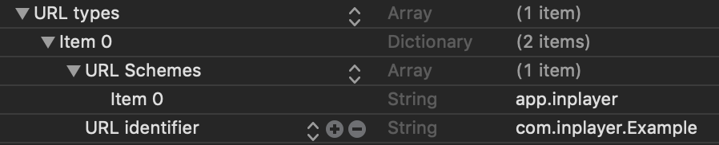

<h1 align="center">
  
</h1>

## Social Login

The InPlayer SDK provides a way to login with social platforms. In order to do so, please follow the example below.

### Example

First, you will need to edit your plist file with your URL Scheme. That can be done by adding the following lines into your plist file:

After that, in the controller where you want to introduce the social login, you can call the endpoint with the same URL Scheme you have entered in your plist file:

    InPlayer.Account.getSocialUrls(redirectUri: "app.inplayer://", success: { (socialUrls) in
    }) { (error) in
    }

This will return you a list of social login options for you to choose from (Facebook, Twitter, Google etc). 

After clicking on one you just call
    
    InPlayer.Account.socialLogin(withUrl: url) { (account, error) in
    }

This will open the social url into external browser and allow you to log in with your credentials. After successfull login it will present you a pop-up asking you if you want to open your application. You should respond with `Yes`. Then you are returned to your app and in the completion you get the account or error if any occur. 

One additional thing is needed in order any of the above to work. You will need to head to your `AppDelegate` and in the following method

    func application(_ app: UIApplication, open url: URL, options: [UIApplication.OpenURLOptionsKey : Any] = [:]) -> Bool

insert this line of code:

    InPlayer.Account.validateSocialLogin(url: url)

This line will intercept the token after successfull login. 

